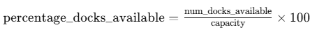
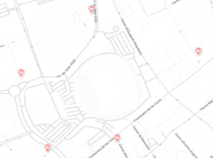
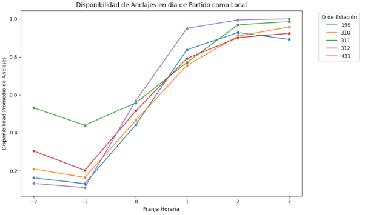
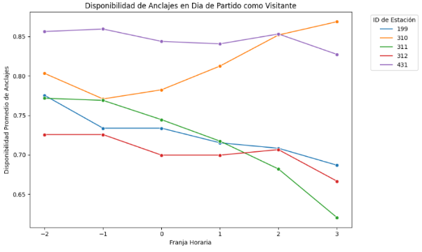

# **Memoria del Capstone Project**
## **1. Introducción**
Este documento presenta la memoria del trabajo realizado en el proyecto de predicción de disponibilidad de anclajes en estaciones de Bicing. El objetivo principal es predecir el porcentaje de anclajes libres en cada estación para la siguiente hora utilizando datos históricos. A lo largo del desarrollo del proyecto, se han explorado diferentes enfoques de modelado, optimizado el procesamiento de datos y analizado casos de uso específicos, como el impacto de eventos deportivos en la disponibilidad de bicicletas.
## **2. Desarrollo del Proyecto**
### **2.1. Preparación de Datos**
El primer paso consistió en analizar las características proporcionadas en el dataset y determinar cuáles debían utilizarse para estructurar la tabla de entrenamiento. 

--------->>>>>>>>>  !!! (Si alguien, ha hecho un poco de estudio de correlaciones y distribuciones entre caracteristicas estaría bien compartirlo aqui) !!!

Se calculó la variable objetivo **percentage\_docks\_available** utilizando la fórmula:

La capacidad de cada estación proviene de otro dataset, que se integró mediante un **merge** por el identificador de la estación (**station\_id**). Posteriormente, se realizaron las siguientes transformaciones:

- Eliminación de registros con valores nulos.
- Formateo de la variable **last\_reported** para ajustarla a la estructura de la tabla de entrenamiento.
- Conversión de registros con frecuencia de 5 minutos a registros por hora, calculando la media por cada hora.
- Creación de las variables contextuales **ctx-1, ctx-2, ctx-3, ctx-4**, indicando la disponibilidad en las cuatro horas previas a la observación actual. Esto se logró con el siguiente código:

for i **in** range(1, 5):  *# Creamos ctx-1 hasta ctx-4*

`    `df[f"ctx-**{**i**}**"] = df.groupby("station\_id")["percentage\_docks\_available"].shift(i)

### **2.2. Primer Entrenamiento y Evaluación de Modelos**
Para la fase inicial de entrenamiento, se utilizó un subconjunto de los datos, correspondiente a un mes de registros de Bicing. Se probaron diferentes modelos de entrenamiento, obteniendo los siguientes resultados:

|**Modelo**|**MSE**|**R²**|
| :-: | :-: | :-: |
|Regresión Lineal|0\.0257|0\.7690|
|Árbol de Decisión|0\.0476|0\.5722|
|Random Forest|0\.0251|0\.7743|
|SVM|0\.0281|0\.7472|
|XGBoost|0\.0261|0\.7653|
|RNN|0\.0266|0\.7600|

El modelo **Random Forest** mostró el mejor rendimiento en esta fase, por lo que se optó por continuar con él para pruebas adicionales.
### **2.3. Entrenamiento con el Dataset Completo (2020-2023)**
Se decidió ampliar el entrenamiento utilizando todos los registros desde 2020 hasta 2023. Sin embargo, al cargar el conjunto de datos completo, surgieron problemas de memoria. Se exploraron varias estrategias para solucionarlo:

- Uso de la librería **Dask** para la aplicación de transformaciones previas antes de cargar los datos en memoria.
- Procesamiento y transformación de los archivos uno a uno antes de realizar el entrenamiento.

Finalmente, esta última estrategia permitió entrenar los modelos sin errores de memoria. Se evaluaron los tres modelos con mejor desempeño en la fase anterior, obteniendo los siguientes resultados:

|**Modelo**|**MSE**|**R²**|
| :-: | :-: | :-: |
|Random Forest|0\.0116|0\.8697|
|XGBoost|0\.0107|0\.8781|
|Regresión Lineal|0\.0128|0\.8500|

El modelo **XGBoost** demostró ser la mejor opción, logrando la menor pérdida (MSE) y el mayor coeficiente de determinación (R²).
### **2.4. Incorporación de Variables Adicionales**
Para mejorar la precisión del modelo, se evaluó la incorporación de variables exógenas, específicamente datos meteorológicos de Barcelona. Esta integración permitió una reducción marginal del error del modelo. Se emplearon series temporales históricas de temperatura y presión media diaria, obtenidas de múltiples estaciones de medición distribuidas por la ciudad (https://opendata-ajuntament.barcelona.cat/data/es/dataset/mesures-estacions-meteorologiques). Los datos fueron preprocesados y consolidados en un único dataframe, alineados temporalmente con las observaciones del modelo y utilizados tanto en la fase de entrenamiento como en la inferencia.

Adicionalmente, se analizó el impacto de la pandemia eliminando los registros correspondientes a los meses de COVID-19, con el objetivo de evaluar si estos datos afectaban negativamente al modelo.
## **3. Estudios de Caso**
### **3.1. Impacto de los Partidos del FC Barcelona en la Disponibilidad de Bicing**
Se realizó un estudio específico para analizar cómo afectan los partidos del **FC Barcelona** en el **Camp Nou** a la disponibilidad de bicicletas en las estaciones más cercanas.
#### **Definición del Caso de Estudio**
1. Se seleccionaron las **5 estaciones de Bicing más cercanas** al Camp Nou.

1. Se analizaron los partidos de la temporada **2022-2023** hasta la jornada 37, justo después empezaron las obras en el Camp Nou
1. Se obtuvo un dataset con la fecha y hora de los partidos, equipos participantes y resultado, extraído de la página de estadísticas[LiveFutbol](https://www.livefutbol.com/equipos/fc-barcelona/21/).
1. Se estableció el **período de impacto** en la disponibilidad de bicicletas: **desde 2 horas antes hasta 3 horas después del inicio del partido**.
#### **Análisis y Resultados**
- Se realizó un **merge** entre el dataset de registros de Bicing, la información de las estaciones y los datos de los partidos.
- Para cada hora registrada, se tomó el último valor de disponibilidad en lugar de la media.
- Se creó una función para marcar los registros dentro del **período de impacto**.
- Se comparó la disponibilidad de las estaciones en partidos jugados como local frente a partidos como visitante.
#### **Hallazgos**
- **Antes del partido**, la disponibilidad de bicicletas disminuye considerablemente (las estaciones están llenas de bicicletas).
- **Después del partido**, la disponibilidad aumenta drásticamente (las estaciones se vacían, ya que los asistentes usan las bicicletas para volver a casa).

Se presentan gráficos ilustrativos que validan estas tendencias.

### Equipo

-Pablo Andrés Castillo Jiménez

-Marc Gassol

-Juan Jose Lovera Brito

